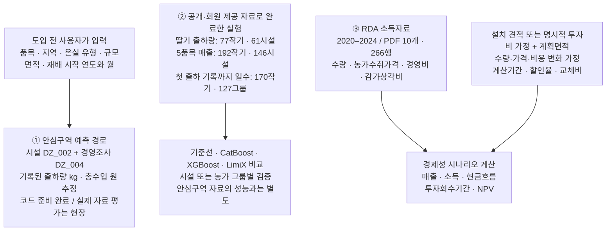
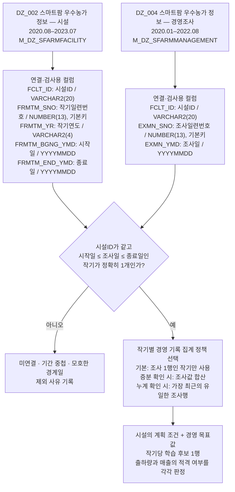
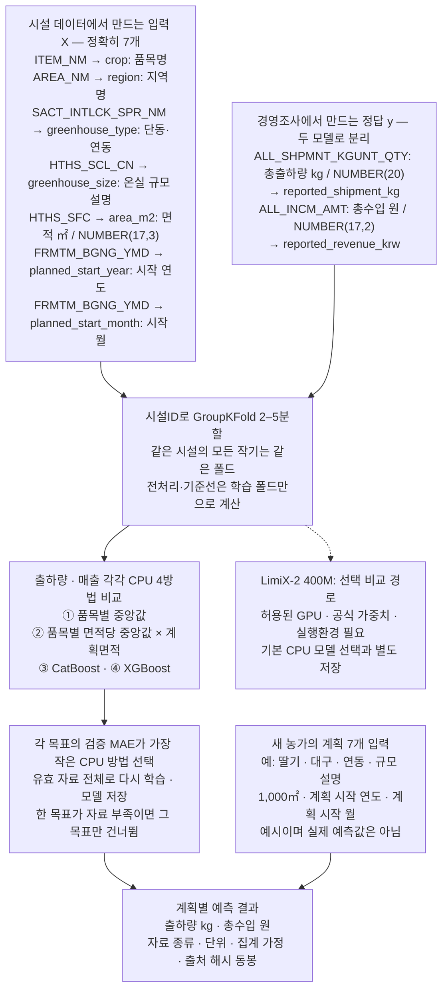
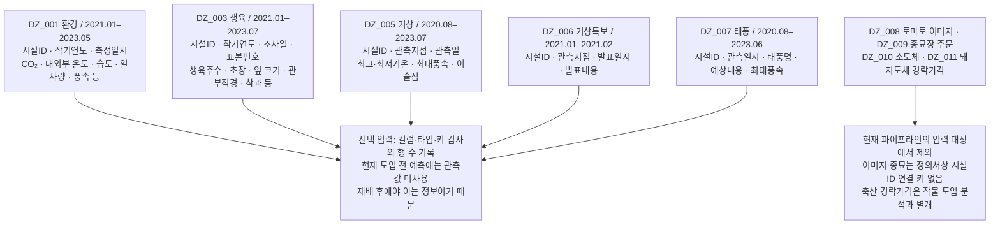
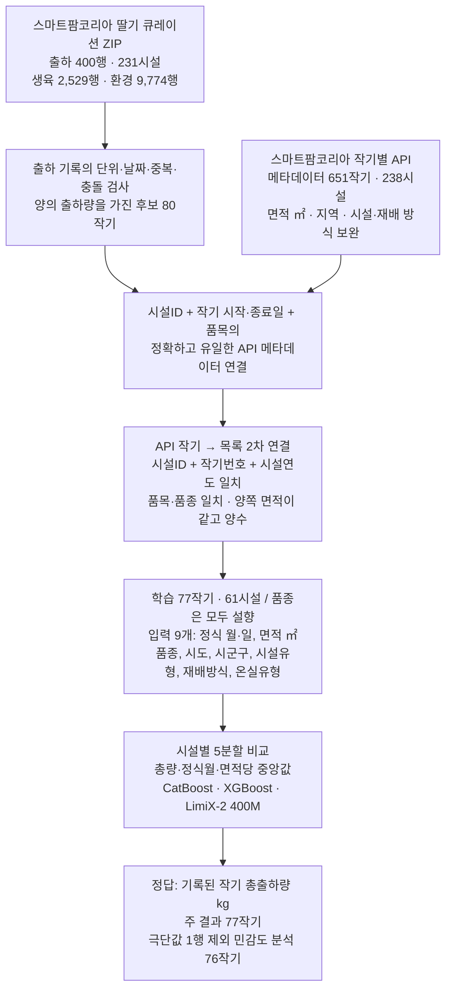
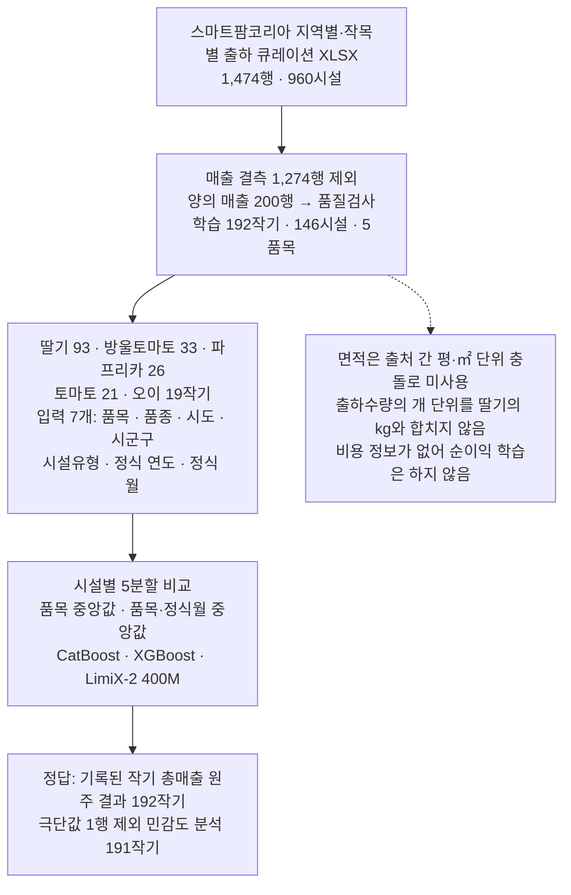
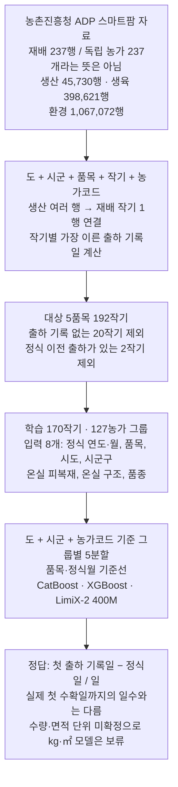
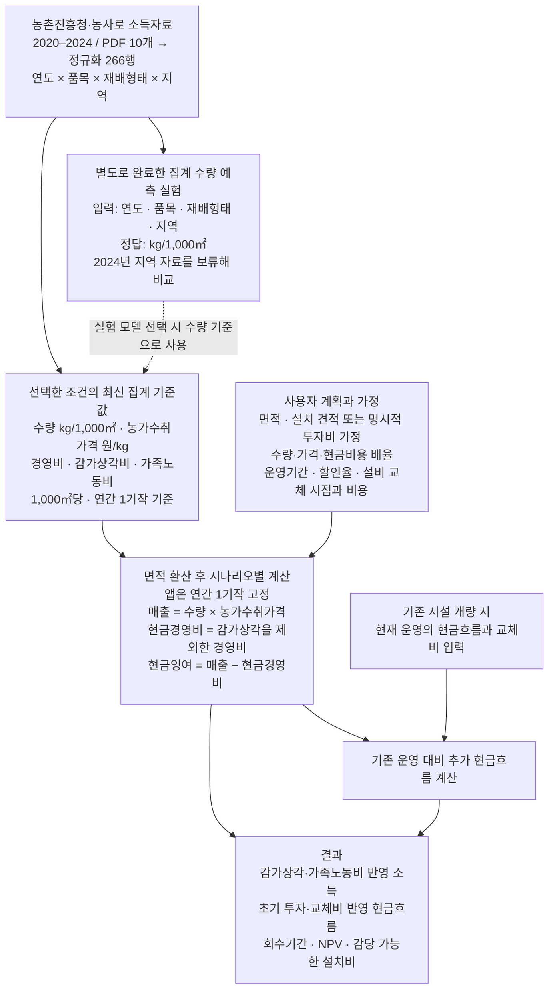
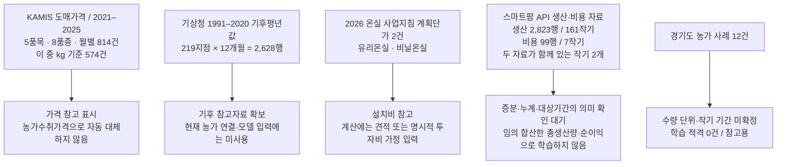

# 어떤 데이터를 어디에 쓰는가

2026-10-09까지 완료한 로컬 실험과 현재 코드 기준입니다. **대회 미개방 원자료는 로컬 0행**이며, 안심구역 경로는 명세서와 합성 예제로 준비했습니다. 아래 수집 건수는 원자료의 행 수이고, 학습에 남은 작기·시설 수는 별도로 표시했습니다. 작기는 작물을 한 번 재배하는 기간입니다.

## 1. 서비스 전체 구조

①·②의 작기별 총량 예측은 현재 ③의 연간·면적당 경제성 계산에 자동 연결하지 않습니다. 연결하려면 대상 기간의 완결성, 면적 기준, 연간 환산을 먼저 확인해야 합니다.

## 2. 대회 핵심 데이터: 시설과 경영조사 연결

농림수산식품교육문화정보원이 제공한 정의서의 영문 컬럼명을 그대로 표시했습니다. 기간은 사용자가 제공한 대회 목록 기준이며, 두 자료에서 실제로 겹치는 시설과 작기는 현장 파일로 확인합니다.

**시설ID만으로 모든 행을 붙이지 않습니다.** 동일 시설에도 여러 작기가 있고 경영조사는 작기ID가 없기 때문입니다. 시작일·종료일은 연결에 쓰되, 실제 종료일을 예측 입력으로 쓰지는 않습니다. 적재일시 `STR_DT`와 적재사용자 `STR_USERID`도 예측 입력에서 제외합니다.

명세서만으로 경영조사 값이 증분인지 누계인지, 완결된 작기 총량인지 확정할 수 없습니다. 코드의 모든 집계 정책은 `target_period_confirmed=false`를 유지합니다. 0은 기록값으로 보존하고 결측을 0으로 바꾸지 않습니다.

## 3. 어떤 컬럼을 넣어서 무엇을 예측하는가

총수입은 **순이익이 아닙니다**. 시설ID·작기ID는 식별·검증용이며 모델 특성이 아닙니다. OOF는 각 행이 학습에 들어가지 않은 폴드에서 얻은 예측이며, 그 점수로 모델을 선택했으므로 독립된 최종 평가 점수는 아닙니다.

현재 검증용 입력은 **합성 40시설 × 2작기 = 80행**입니다. 실제 미개방 자료의 품목 분포·행 수·결측률·예측 정확도는 아직 확인하지 않았습니다.

## 4. 나머지 농정원 데이터의 현재 역할

환경·생육으로 재배 중 생육 변화를 예측하려면 별도 목표와 시간 기준을 설계해야 합니다. 현재 구현 범위는 **도입 전에 알 수 있는 계획 조건으로 출하량·매출을 비교하는 서비스**입니다.

## 5. 실제 자료로 완료한 세 가지 농가 단위 실험

### 딸기: 기록된 작기 총출하량 kg

생육·환경 관측값과 실제 종료일은 모델 특성에 넣지 않았습니다. 원본 출하 파일에 없는 면적을 API에서 확인했으며, 단위 확인 없이 면적을 추정하지 않았습니다.

### 5품목: 기록된 작기 총매출 원

### ADP: 정식 후 첫 출하 기록까지 걸린 일수

세 실험의 표본과 정답이 다르므로 하나의 통합 정확도로 묶지 않습니다. 모델별 수치와 극단값의 영향은 [실험 결과](MODEL_RESULTS.md)에 있습니다. LimiX는 고정된 사전학습 가중치로 비교했으며 항상 가장 좋은 결과를 낸 것은 아닙니다.

## 6. 경제성 계산에 실제로 들어가는 자료

수량 증가·비용 절감은 사용자 시나리오 가정입니다. 스마트팜 장비 설치의 인과효과를 학습한 모델이나 수익 보장 결과가 아닙니다. 작기별 출하량·매출 예측을 위 연간 계산에 자동 대입하는 기능은 구현하지 않았습니다.

## 7. 수집했지만 주 예측 입력으로 쓰지 않은 자료

API 전체 4,224행은 목록 651 + 작기 메타데이터 651 + 생산 2,823 + 비용 99의 합입니다. 독립 학습 표본 수가 아닙니다. API 메타데이터 일부는 위 딸기 실험의 입력과 지역 큐레이션의 면적 감사에 사용했습니다. 지역 매출 모델의 입력에는 면적을 포함하지 않았습니다.

## 근거와 실행 파일

- 데이터 원문·반영 범위: [DATA_SCOPE.md](DATA_SCOPE.md), [정의서 컬럼 설정](config/dsz_schema.json)
- 시설·경영조사 연결: [src/dsz_data.py](src/dsz_data.py), [현장 데이터 계약](reports/dsz_schema_contract.md)
- 계획 입력·두 목표·검증: [src/dsz_model.py](src/dsz_model.py), [모델 실행법](reports/dsz_model_method.md)
- 완료한 농가 모델: [딸기](src/strawberry_curation_model.py), [매출](src/regional_curation_model.py), [ADP 일수](src/adp_timing_model.py)
- 경제성 계산: [src/economics.py](src/economics.py), [MODEL_RESULTS.md](MODEL_RESULTS.md)

GitHub에는 코드·정의서·집계 결과·합성 예제를 올렸습니다. 실제 농가 원행·인증 정보·학습 모델은 포함하지 않았습니다.
