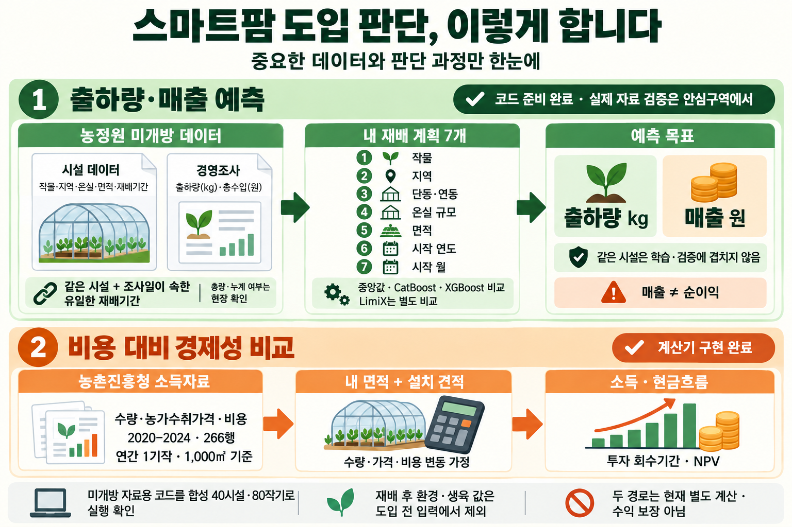
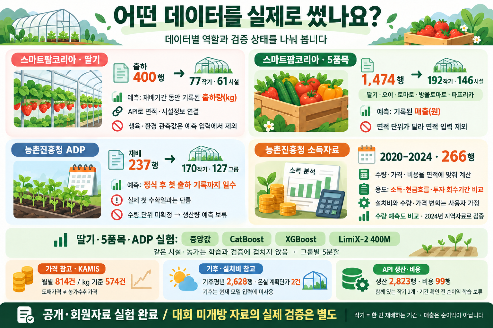

# 스마트팜 도입 전 판단 도우미

**작물·지역·온실·면적·재배 시작 시점을 입력해 출하량과 매출을 추정하고, 설치비·운영비 가정에 따른 경제성을 비교하는 연구용 프로젝트입니다.**

[PPT 기획서](presentation/smartfarm_proposal.pptx) · [실행 대시보드 화면](assets/dashboard/) · [계산 예시와 가정](reports/planning_demo_summary.json) · [실제 가격 검증 결과](reports/price_forecast_metrics_summary.json)

[전 과정 구현·자료 한계·검증 근거](reports/full_process_delivery.md)에 최신 상태를 정리했습니다. 아래 그림은 도입 전 예측의 기본 구조이며, 추가한 설비·가격·날씨 연결과 재배 중 생육 분석은 PPT와 상세 다이어그램에서 확인할 수 있습니다.





**[사용 데이터·컬럼·연결 키·모델 입력·출력을 상세 다이어그램으로 보기 → DATA_FLOW.md](DATA_FLOW.md)**

원래의 기술 도식도 유지합니다: [시설·경영조사 연결과 모델](assets/diagrams/dsz-data-flow.png) · [실제 데이터 분석 전체 흐름](assets/diagrams/actual-data-flow.png). 쉬운 설명 그림은 이미지 생성 도구로 제작했으며, [생성 문안](assets/diagrams/easy-explanation.prompts.json)과 [문구 수정 내역](assets/diagrams/easy-explanation.edits.json)을 함께 보관합니다.

작기별 예측은 연간 경제성 계산에 자동 연결하지 않습니다. 실제 미개방 원자료는 로컬에 없으며, 현장 실행 코드는 합성 40시설·80작기로 검증했습니다.

## 지금까지 만든 것

| 구성 | 완료한 작업 | 결과 해석 |
|---|---|---|
| 자료 수집 | RDA 소득자료, ADP 농가자료, 스마트팜코리아 API·큐레이션 자료, 가격·기후·설치 계획단가 수집 | 원자료는 이 저장소에 재배포하지 않음 |
| 실제 모델 비교 | 딸기 77작기 출하량, 5품목 192작기 매출에 기준선·CatBoost·XGBoost·LimiX 비교 | 공개·회원 제공 자료 실험, 대회 미개방 자료의 성능이 아님 |
| 재배 중 생육 점검 | 실제 생육·과거 7/28일 환경을 40개 방문 쌍·21시설로 연결하고 33입력 후보 비교 | 7일 뒤 시설·방문 표본 평균 초장; 생육만 사용한 MAE 32.61mm가 환경 추가보다 우수 |
| 설비비 계산 | 공개 장비 3종의 묶음 가격·수량·선택 옵션 + 명시한 설치비·부가세·기타 투자비 | 등록 표준가격이며 실제 설치 견적 아님; 누락 비용은 0으로 간주하지 않음 |
| 가격 예측 실험 | KAMIS 원/kg 574관측·12시계열로 2024 모형 선택 → 2025 고정 검증 | 선택 모형 MAE 1,249.16원/kg, 계절 기준선 1,061.62원/kg; 기준선이 더 우수 |
| 경제성 계산기 | 수량·가격·운영비 가정으로 손익·현금흐름·회수기간과 2,000회 민감도 계산 | 수익 보장 모델이 아니며 분포는 입력 가정의 결과 |
| 안심구역 실행 코드 | 시설·경영조사 검사 → 작기 연결 → 학습·평가 → 모델 저장 → 계획 예측 | 실제 미개방 파일은 현장에서 입력 |
| 재현용 예제 | 합성 40시설·80작기, 5품목으로 전체 실행 검증 | **실제 정확도로 인용할 수 없는 합성 데이터** |

실제 비교 숫자와 한계는 [MODEL_RESULTS.md](MODEL_RESULTS.md), 데이터 포함 범위는 [DATA_SCOPE.md](DATA_SCOPE.md)에 정리했습니다.

## 끝까지 계산한 예시

전국 시설딸기(수경) 1,000㎡·연 1작기, 10년·할인율 4%의 **기능 시연용 계획**입니다. 수확량 기준은 2023–2024년 해당 집계 2행의 중앙값 3,344.5kg이며, 개인 농가의 2027년 생산성을 검증한 예측이 아닙니다. 2024년 농가 수취단가·운영비와 명시한 투자 가정을 사용했습니다.

- 선택 장비 2,457.3만원 + 설치 500만원 + 추가 부가세 295.73만원 + 온실 등 기타 투자 8,000만원 = **초기 투자 1억 1,253.03만원**. 설치·부가세·기타 금액은 견적이 아닌 시연 가정입니다.
- 기준 시나리오: 연 매출 **3,634.80만원**, 감가상각 포함 경영비 차감 소득 **1,556.51만원**, 가족노동 기회비용까지 차감하면 **346.68만원**입니다.
- 투자 회수는 가족노동 기회비용 차감 전 현금흐름으로 **6년차**에 도달합니다. 불리한 시나리오는 10년 안에 회수하지 못합니다.

장비 설치의 수확 증가 효과는 가정하지 않았습니다. 10년간 같은 연간 조건과 교체비 0을 사용했고, 세금·금융·보조금·운전자금·처분가치는 제외했습니다. 모든 입력·시나리오·분포 요약은 [계산 근거 JSON](reports/planning_demo_summary.json)에 있습니다.

가격과 날씨도 사용자가 명시적으로 선택한 경우에 계산에 반영합니다. 보관된 2025년 말 기준 2026년 도매가격 전망의 상대 변화만 농가 수취단가에 전달하거나, 기상청 1991–2020 평년값을 참고해 연간 수량·현금운영비 영향률을 직접 가정하는 방식입니다. **실시간 예보나 학습된 기상 인과효과가 아닙니다.** [연결 시연 결과](reports/planning_reference_scenarios.json)

## 바로 실행: 명세서 기반 CPU 데모

Python 3.12를 사용합니다. 아래 명령은 GitHub 소스에서 필요한 패키지를 설치하는 방식입니다. 가중치·API 키·GPU는 필요 없습니다. 패키지 설치 단계에는 인터넷 또는 사전에 준비한 wheel 파일이 필요합니다.

```powershell
python -m venv .venv
.\.venv\Scripts\python.exe -m pip install -r requirements-dsz-cpu.txt
.\run_dsz.ps1 -Demo -Python .\.venv\Scripts\python.exe -UseExistingEnvironment
```

출력은 `runs/날짜_시각/` 아래에 생성됩니다.

- `prepared/`: 입력 검사, 제외 사유, 학습 후보, 출처·해시
- `models/`: 두 타깃의 비교 지표, 검증 예측, 선택한 모델
- `predictions.csv`: 계획 조건별 출하량(kg)·매출(원) 예측

이 저장소에는 설치용 wheelhouse가 없으므로 설치 전 `run_dsz.ps1 -Demo`만 실행하지 마세요. 긴 Windows 경로를 피하고 짧은 폴더에 저장하는 것을 권장합니다.

PowerShell을 쓰지 않는 환경에서는 설치한 Python으로 다음을 실행합니다.

```bash
python scripts/prepare_dsz.py --input-dir data/examples/dsz/input --output-dir runs/demo/prepared
python scripts/train_dsz.py --data-dir runs/demo/prepared --output-dir runs/demo/models
python scripts/predict_dsz.py --artifact-dir runs/demo/models --plans data/examples/dsz/example_plans.csv --output runs/demo/predictions.csv
```

## 실제 안심구역 파일을 넣을 때

필수 입력은 **DZ_002 시설**과 **DZ_004 경영조사**입니다. 시설ID와 조사일이 포함되는 유일한 작기를 연결하며, 중복·기간 모호성·결측을 기록합니다.

```powershell
.\run_dsz.ps1 -InputDir D:\approved_data -Plans D:\plans.csv `
  -ManagementPolicy single_record_per_cycle `
  -Python .\.venv\Scripts\python.exe -UseExistingEnvironment
```

계획 CSV는 `data/examples/dsz/example_plans.csv`의 형식을 사용합니다. 입력은 품목·지역·단동/연동·온실 규모 설명·면적·시작 연도·월의 7개입니다. 재배 후 환경·생육·실제 종료일은 사전 예측 입력에 넣지 않습니다.

경영조사 행의 의미에 따라 `single_record_per_cycle`, `incremental_sum`, `latest_cumulative`를 선택합니다. 정의서만으로 증분·누계·완결된 작기 총량 여부가 확정되는 것은 아닙니다. 0과 결측을 구분하고, 출하량과 매출은 각각 자료가 충분한 경우에만 학습합니다.

[현장 실행 안내](reports/dsz_onsite_guide.md) · [입력 계약](reports/dsz_schema_contract.md) · [모델 방법](reports/dsz_model_method.md)

## 전체 연구 코드와 대시보드

`app.py`는 원래 로컬 연구 환경의 Streamlit 계산기입니다. **이 소스 저장소에는 원자료·실제 농가별 예측·학습 산출물을 포함하지 않으므로, 새로 복제한 상태에서는 DSZ 합성 데모를 먼저 사용하세요.** 대시보드는 별도 확보한 RDA·가격·설치비 정규화 파일과 모델 산출물이 필요합니다. 필요한 파일 목록은 [DATA_SCOPE.md](DATA_SCOPE.md)를 따릅니다.

로컬 연구 환경에서는 **한눈에 보기 / 도입 전 계산 / 가격 예측 / 재배 중 점검 / 모델 검증 / 수집 자료**의 6개 탭이 작동합니다. 계획 입력 → 장비 구성 → 경제성 시나리오 → 민감도 차트와 실제 가격·생육 실험을 확인할 수 있습니다. **공개 GitHub 저장소 자체가 대시보드 호스팅 주소는 아닙니다.** 장비 카탈로그만 공개가격 예외로 포함하고, 실제 농가 자료를 요구하지 않는 요약 결과와 [화면 이미지](assets/dashboard/)를 제공합니다. 공개가격을 재정리하려면 `python scripts/prepare_equipment_catalog.py`를 실행합니다.

가격곡선은 보관된 2025년 말 자료로 만든 **2026년 전망 실험**이며 현재 시점 실시간 예측이 아닙니다. 중도매인 가격을 농가 수취가격으로 자동 대입하지 않습니다. [가격·민감도 방법](reports/price_forecast_notes.md) · [설비 가격 계산 원칙](reports/equipment_catalog_notes.md)

재배 중 점검은 실제 관측 환경·생육을 이용한 별도 실험입니다. 현재 생육 9개 입력과 과거 환경 요약 24개를 연결했으며, 현재 초장 유지 기준선 MAE 36.08mm, 생육 CatBoost 32.61mm, 환경 추가 XGBoost 34.59mm였습니다. 작은 후향 표본의 시설 분리 검증이며 개별 식물의 성장·수확량이나 투자 효과를 뜻하지 않습니다. [방법과 한계](reports/inseason_model_notes.md) · [집계 결과](reports/inseason_metrics_summary.json)

기존 공개자료 수집·정규화·학습 코드는 `scripts/`와 `src/`에 있습니다. API 수집기는 환경변수 `SMARTFARM_API_KEY`를 읽으며 키를 소스에 넣지 않습니다. API 신청·권한은 각 사용자 계정에서 준비합니다.

LimiX 실험은 별도의 공식 코드·검토된 패치·가중치·CUDA 환경이 필요합니다. `requirements-limix.txt`만으로 모든 준비가 끝나는 것은 아니며, 이 저장소의 기본 CPU 경로에는 필요하지 않습니다. Built with StableAI LimiX.

## 검증

2026-10-10 공개 저장소의 기본 검사는 **215개 통과·1개 건너뜀·63개 하위 검사 통과**입니다. 로컬 원자료가 필요한 앱 검사는 아래 설명대로 제외했으며, 실제 자료를 갖춘 로컬 전체 검사에서는 224개와 63개 하위 검사가 통과했습니다. Python 독립 검토와 Windows x64 / Python 3.12의 별도 환경에서 오프라인 패키지 설치·합성 실행도 확인했습니다. 센터 환경의 호환성이나 반입 승인을 확인했다는 뜻은 아닙니다.

이 저장소의 단위·합성 테스트:

```powershell
.\.venv\Scripts\python.exe -m pip install -r requirements.txt
.\.venv\Scripts\python.exe -m pytest -q
```

실제 로컬 자료가 필요한 `tests/test_app.py`는 기본 검사에서 제외합니다. 해당 자료와 산출물을 직접 준비한 환경에서만 `python -m pytest -o addopts= tests/test_app.py -q`로 실행합니다. 합성 테스트 통과는 실제 농가 예측 성능 검증과 다릅니다.

## 주요 파일

```text
src/                 데이터 연결·모델·경제성 계산
scripts/             수집·정규화·학습·예측 CLI
config/dsz_schema.json  정의서에서 옮긴 79개 필드
data/examples/dsz/   명확히 표시한 합성 예제
data/raw/dsz/        데이터 정의서만 포함
reports/            현장 실행 계약과 방법
assets/             소개 이미지와 생성 프롬프트
presentation/       편집 가능한 PPT 기획서
tests/              동작·누수·출처 검증
```
