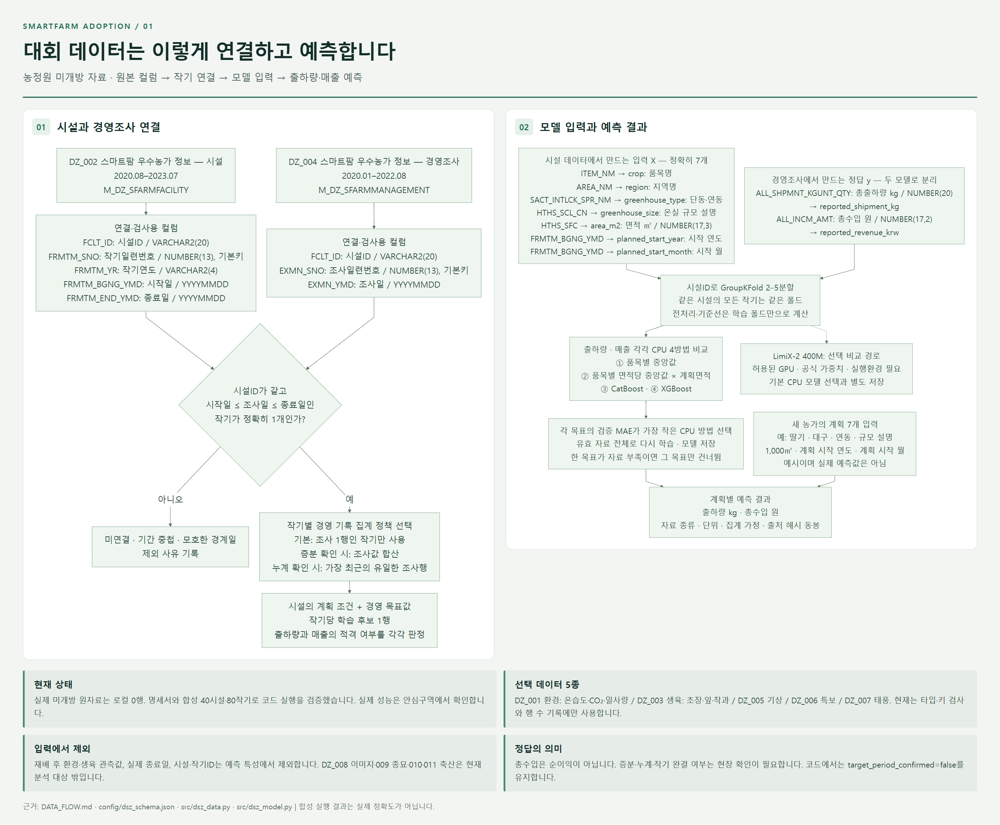
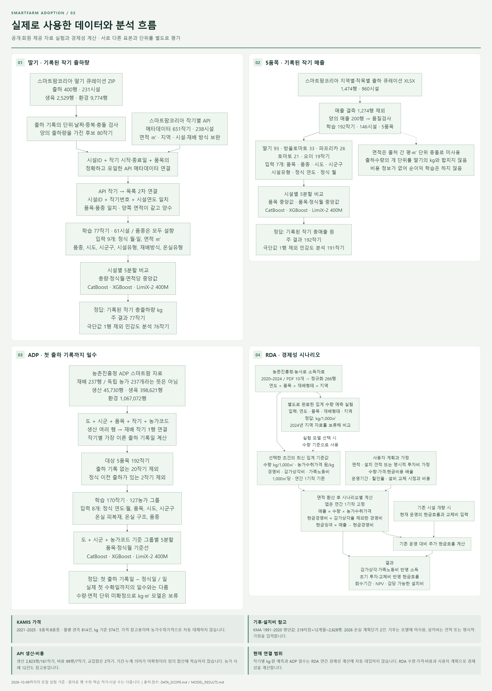

# 스마트팜 도입 전 판단 도우미

**작물·지역·온실·면적·재배 시작 시점을 입력해 출하량과 매출을 추정하고, 설치비·운영비 가정에 따른 경제성을 비교하는 연구용 프로젝트입니다.**





**[사용 데이터·컬럼·연결 키·모델 입력·출력을 상세 다이어그램으로 보기 → DATA_FLOW.md](DATA_FLOW.md)**

작기별 예측은 연간 경제성 계산에 자동 연결하지 않습니다. 실제 미개방 원자료는 로컬에 없으며, 현장 실행 코드는 합성 40시설·80작기로 검증했습니다.

## 지금까지 만든 것

| 구성 | 완료한 작업 | 결과 해석 |
|---|---|---|
| 자료 수집 | RDA 소득자료, ADP 농가자료, 스마트팜코리아 API·큐레이션 자료, 가격·기후·설치 계획단가 수집 | 원자료는 이 저장소에 재배포하지 않음 |
| 실제 모델 비교 | 딸기 77작기 출하량, 5품목 192작기 매출에 기준선·CatBoost·XGBoost·LimiX 비교 | 공개·회원 제공 자료 실험, 대회 미개방 자료의 성능이 아님 |
| 경제성 계산기 | 설치비·수량·가격·운영비 가정으로 손익·현금흐름·회수기간 계산 | 설치 견적은 사용자 입력, 투자수익 보장 모델이 아님 |
| 안심구역 실행 코드 | 시설·경영조사 검사 → 작기 연결 → 학습·평가 → 모델 저장 → 계획 예측 | 실제 미개방 파일은 현장에서 입력 |
| 재현용 예제 | 합성 40시설·80작기, 5품목으로 전체 실행 검증 | **실제 정확도로 인용할 수 없는 합성 데이터** |

실제 비교 숫자와 한계는 [MODEL_RESULTS.md](MODEL_RESULTS.md), 데이터 포함 범위는 [DATA_SCOPE.md](DATA_SCOPE.md)에 정리했습니다.

## 바로 실행: 명세서 기반 CPU 데모

Python 3.12를 사용합니다. 아래 명령은 GitHub 소스에서 필요한 패키지를 설치하는 방식입니다. 가중치·API 키·GPU는 필요 없습니다. 패키지 설치 단계에는 인터넷 또는 사전에 준비한 wheel 파일이 필요합니다.

```powershell
python -m venv .venv
.\.venv\Scripts\python.exe -m pip install -r requirements-dsz-cpu.txt
.\run_dsz.ps1 -Demo -Python .\.venv\Scripts\python.exe -UseExistingEnvironment
```

출력은 `runs/날짜_시각/` 아래에 생성됩니다.

- `prepared/`: 입력 검사, 제외 사유, 학습 후보, 출처·해시
- `models/`: 두 타깃의 비교 지표, 검증 예측, 선택한 모델
- `predictions.csv`: 계획 조건별 출하량(kg)·매출(원) 예측

이 저장소에는 설치용 wheelhouse가 없으므로 설치 전 `run_dsz.ps1 -Demo`만 실행하지 마세요. 긴 Windows 경로를 피하고 짧은 폴더에 저장하는 것을 권장합니다.

PowerShell을 쓰지 않는 환경에서는 설치한 Python으로 다음을 실행합니다.

```bash
python scripts/prepare_dsz.py --input-dir data/examples/dsz/input --output-dir runs/demo/prepared
python scripts/train_dsz.py --data-dir runs/demo/prepared --output-dir runs/demo/models
python scripts/predict_dsz.py --artifact-dir runs/demo/models --plans data/examples/dsz/example_plans.csv --output runs/demo/predictions.csv
```

## 실제 안심구역 파일을 넣을 때

필수 입력은 **DZ_002 시설**과 **DZ_004 경영조사**입니다. 시설ID와 조사일이 포함되는 유일한 작기를 연결하며, 중복·기간 모호성·결측을 기록합니다.

```powershell
.\run_dsz.ps1 -InputDir D:\approved_data -Plans D:\plans.csv `
  -ManagementPolicy single_record_per_cycle `
  -Python .\.venv\Scripts\python.exe -UseExistingEnvironment
```

계획 CSV는 `data/examples/dsz/example_plans.csv`의 형식을 사용합니다. 입력은 품목·지역·단동/연동·온실 규모 설명·면적·시작 연도·월의 7개입니다. 재배 후 환경·생육·실제 종료일은 사전 예측 입력에 넣지 않습니다.

경영조사 행의 의미에 따라 `single_record_per_cycle`, `incremental_sum`, `latest_cumulative`를 선택합니다. 정의서만으로 증분·누계·완결된 작기 총량 여부가 확정되는 것은 아닙니다. 0과 결측을 구분하고, 출하량과 매출은 각각 자료가 충분한 경우에만 학습합니다.

[현장 실행 안내](reports/dsz_onsite_guide.md) · [입력 계약](reports/dsz_schema_contract.md) · [모델 방법](reports/dsz_model_method.md)

## 전체 연구 코드와 대시보드

`app.py`는 원래 로컬 연구 환경의 Streamlit 계산기입니다. **이 소스 저장소에는 원자료·실제 농가별 예측·학습 산출물을 포함하지 않으므로, 새로 복제한 상태에서는 DSZ 합성 데모를 먼저 사용하세요.** 대시보드는 별도 확보한 RDA·가격·설치비 정규화 파일과 모델 산출물이 필요합니다. 필요한 파일 목록은 [DATA_SCOPE.md](DATA_SCOPE.md)를 따릅니다.

기존 공개자료 수집·정규화·학습 코드는 `scripts/`와 `src/`에 있습니다. API 수집기는 환경변수 `SMARTFARM_API_KEY`를 읽으며 키를 소스에 넣지 않습니다. API 신청·권한은 각 사용자 계정에서 준비합니다.

LimiX 실험은 별도의 공식 코드·검토된 패치·가중치·CUDA 환경이 필요합니다. `requirements-limix.txt`만으로 모든 준비가 끝나는 것은 아니며, 이 저장소의 기본 CPU 경로에는 필요하지 않습니다. Built with StableAI LimiX.

## 검증

원래 전체 로컬 환경에서는 **160개 테스트와 63개 하위 검사가 통과**했습니다. Python 독립 검토와 Windows x64 / Python 3.12의 별도 환경에서 오프라인 패키지 설치·합성 실행을 확인했습니다. 센터 환경의 호환성이나 반입 승인을 확인했다는 뜻은 아닙니다.

이 저장소의 단위·합성 테스트:

```powershell
.\.venv\Scripts\python.exe -m pip install -r requirements.txt
.\.venv\Scripts\python.exe -m pytest -q
```

실제 로컬 자료가 필요한 `tests/test_app.py`는 기본 검사에서 제외합니다. 해당 자료와 산출물을 직접 준비한 환경에서만 `python -m pytest -o addopts= tests/test_app.py -q`로 실행합니다. 합성 테스트 통과는 실제 농가 예측 성능 검증과 다릅니다.

## 주요 파일

```text
src/                 데이터 연결·모델·경제성 계산
scripts/             수집·정규화·학습·예측 CLI
config/dsz_schema.json  정의서에서 옮긴 79개 필드
data/examples/dsz/   명확히 표시한 합성 예제
data/raw/dsz/        데이터 정의서만 포함
reports/            현장 실행 계약과 방법
assets/             소개 이미지와 생성 프롬프트
tests/              동작·누수·출처 검증
```
