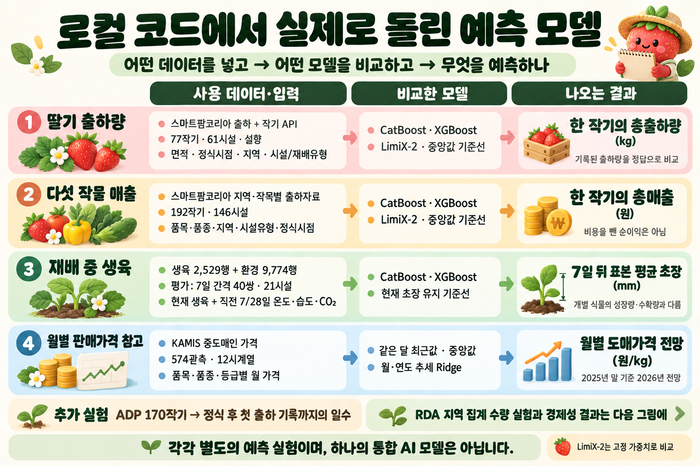
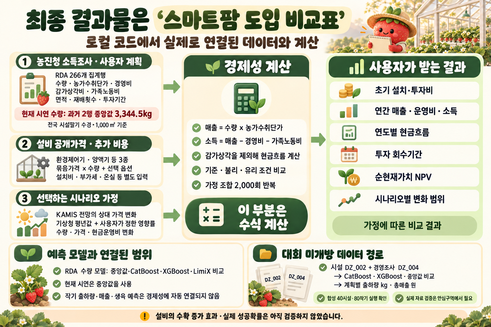

# 로컬 코드: 데이터 → 모델 → 예측값 → 최종 결과물

2026-10-10 실제 로컬 코드와 저장된 실험 산출물을 기준으로 정리했습니다. 서버 배포 구조가 아니라 **데이터를 무엇에 쓰고 어떤 결과를 얻는지** 설명하는 그림입니다.

## 1. 실제 자료로 돌린 예측 실험

| 목적 | 실제 사용 자료와 입력 | 비교 방법 | 결과 단위 |
|---|---|---|---|
| 딸기 출하량 | 스마트팜코리아 출하 큐레이션 + 작기 API. 77작기·61시설, 모두 설향. 정식 월·일, 면적 ㎡, 품종, 시도·시군구, 시설유형·재배방식·온실유형 | 총량·정식월·면적당 중앙값, CatBoost, XGBoost, LimiX-2 | 기록된 작기 총출하량 kg |
| 5품목 매출 | 스마트팜코리아 지역·작목별 출하자료 192작기·146시설. 품목·품종·시도·시군구·시설유형·정식 연도·월. 면적은 단위 충돌로 제외 | 품목·품목×정식월 중앙값, CatBoost, XGBoost, LimiX-2 | 기록된 작기 총매출 원. 비용 차감 전 |
| 재배 중 생육 | 생육 2,529행·환경 9,774행에서 정확히 7일 간격 40쌍·21시설 확보. 현재 생육·이전 변화·달력 9개 입력과 직전 7/28일 온도·습도·CO₂ 요약 24개 후보 | 현재 초장 유지, 생육 CatBoost, 생육+환경 CatBoost, 생육+환경 XGBoost | 7일 뒤 시설·방문 표본 평균 초장 mm |
| 월별 가격 | KAMIS 원/kg 574관측·12시계열. 품목·품종·등급 분리, 결측 월을 0으로 대체하지 않음 | 같은 달 최근값·중앙값, 월 원핫과 연도 추세를 이용한 로그가격 Ridge | 중도매인 판매가격 원/kg. 2025년 말 기준으로 보관된 2026년 전망 |
| 첫 출하 기록 시점 | ADP 재배·생산 자료에서 170작기·127농가 그룹. 정식 연도·월, 품목, 시도·시군구, 온실 피복재·구조, 품종 | 품목·정식월 기준선, CatBoost, XGBoost, LimiX-2 | 정식일에서 첫 출하 **기록일**까지 일수. 실제 첫 수확일까지 일수가 아님 |
| 지역 집계 수량 | RDA 266개 집계행. 연도·품목·재배형태·지역. 조사 분류와 전국/지역을 구분 | 과거 중앙값·최근값, 자료가 충분한 집단의 CatBoost·XGBoost. LimiX-2는 별도 비교 | kg/1,000㎡/년 1기작 기준 |

다섯 품목은 딸기·방울토마토·파프리카·토마토·오이입니다. 모든 자료를 하나의 학습 표에 넣은 구조가 아닙니다. 시설/농가 그룹을 분리한 검증과 가격의 시간 분리 검증을 각각 사용합니다. LimiX-2는 고정된 사전학습 가중치로 문맥 추론했으며 별도 파인튜닝하지 않았습니다.

모델 산출물은 예측값, 실제값과의 오차 비교표, 검증 예측 CSV, 지표 JSON 등입니다. 농가 모델·생육 실험의 검증 점수는 모형 선택에도 사용했으므로 독립된 최종 성능 보장으로 볼 수 없습니다. 상세 결과와 극단값 영향은 [MODEL_RESULTS.md](../../MODEL_RESULTS.md)에 있습니다.

## 2. 최종 도입 비교표를 만드는 경로

최종 결과물은 **설치·투자비, 연간 매출·운영비·소득, 연도별 현금흐름, 회수기간, NPV, 시나리오별 변화 범위**를 보여 주는 비교표입니다. 설정한 기간에 투자비를 회수하기 위해 필요한 연간 물량도 계산합니다.

현재 경제성 계산에 연결된 입력은 다음과 같습니다.

- **농진청 소득조사:** 수량 기준, 농가수취단가, 경영비, 감가상각비, 가족노동 기회비용.
- **공개 장비가격 3종:** 묶음 가격·수량·선택 옵션. 설치비·추가 부가세·온실 등 기타 투자비는 따로 입력합니다. 업체 등록가격이며 현장 견적은 아닙니다.
- **사용자 계획:** 면적, 투자기간, 할인율, 교체비, 수량·가격·현금비용 변화 가정. 로컬 앱은 연간 1기작 기준이며 계산 엔진은 재배횟수 인자를 받습니다.
- **선택적 가격 변화:** KAMIS의 2025년 실제와 보관된 2026년 전망의 동일 월 상대변화를 사용자가 선택하면 농가수취단가의 변화 가정으로 전달합니다. 도매가격 자체를 직접 대입하지 않습니다.
- **선택적 날씨 영향:** 기상청 1991–2020 평년값을 참고하고, 수량·현금운영비 영향률은 사용자가 정합니다. 학습된 기상 영향이나 실시간 예보가 아닙니다.

로컬 앱의 `실험 모델` 선택지는 RDA 수량 예측 함수를 호출합니다. 다만 **현재 저장된 RDA 묶음 4개는 모두 `historical_median`을 선택**했습니다. 딸기 시연의 3,344.5kg도 전국 시설딸기 수경의 같은 조건 2개 연도 집계값 중앙값입니다. LimiX는 RDA 별도 비교 실험이며 앱의 선택 묶음에 포함된 추론 모델이 아닙니다.

**딸기 작기 출하량·5품목 작기 매출·ADP 첫 출하 기록 시점·생육 모델의 예측은 연간 경제성 계산에 자동 연결되지 않습니다.** 작기 총량과 연간·면적당 단위를 맞추고, 대상 기간의 완결성을 확인하는 작업이 필요합니다.

매출은 수량×농가수취단가, 가족노동 반영 소득은 매출−경영비−가족노동 기회비용입니다. 현금흐름은 감가상각을 현금 지출에서 제외하며 가족노동 기회비용 차감 전 기준입니다. 회수기간과 NPV도 이 현금흐름 기준을 사용합니다. 2,000회 민감도는 입력 가정의 조합이며 검증된 예측구간이나 실제 성공확률이 아닙니다. 장비별 수확 증가 효과를 학습한 모델도 없습니다.

## 대회 미개방 데이터용 별도 경로

시설 `DZ_002`와 경영조사 `DZ_004`를 시설ID 및 조사일이 속한 유일한 작기로 연결합니다. 품목·지역·단동/연동·온실규모·면적·시작 연도·월을 입력하고, 출하량과 총수입을 각각 정답으로 삼습니다. 중앙값 기준선·CatBoost·XGBoost를 비교해 계획별 출하량 kg와 총매출 원을 출력하는 코드입니다.

현재 확인된 실행은 **가상 40시설·80작기의 합성 예제**입니다. 실제 미개방 원자료는 로컬에 없으며 안심구역에서 행의 의미·집계 방식·정확도를 검증해야 합니다. 준비된 경로를 실제 자료 학습 완료로 표시하지 않았습니다.

## 코드 근거

- 농가 예측: [딸기 출하량](../../src/strawberry_curation_model.py), [5품목 매출](../../src/regional_curation_model.py), [ADP 일수](../../src/adp_timing_model.py), [RDA 집계 수량](../../src/smartfarm_model.py)
- 재배 중·가격: [생육](../../src/inseason_model.py), [가격](../../src/price_forecast.py)
- 경제성 연결: [로컬 앱](../../app.py), [시나리오 가정](../../src/scenario_assumptions.py), [설비 비용](../../src/equipment_costs.py), [경제성](../../src/economics.py), [민감도](../../src/risk_simulation.py)
- 대회 경로: [데이터 연결](../../src/dsz_data.py), [모델 비교·예측](../../src/dsz_model.py)

두 그림은 내장 `image_gen.imagegen` 도구로 생성했습니다. [생성 문안](local-model.prompts.json)을 함께 보관합니다. 특정 이미지 모델 버전을 지정하거나 확인한 것은 아닙니다.
