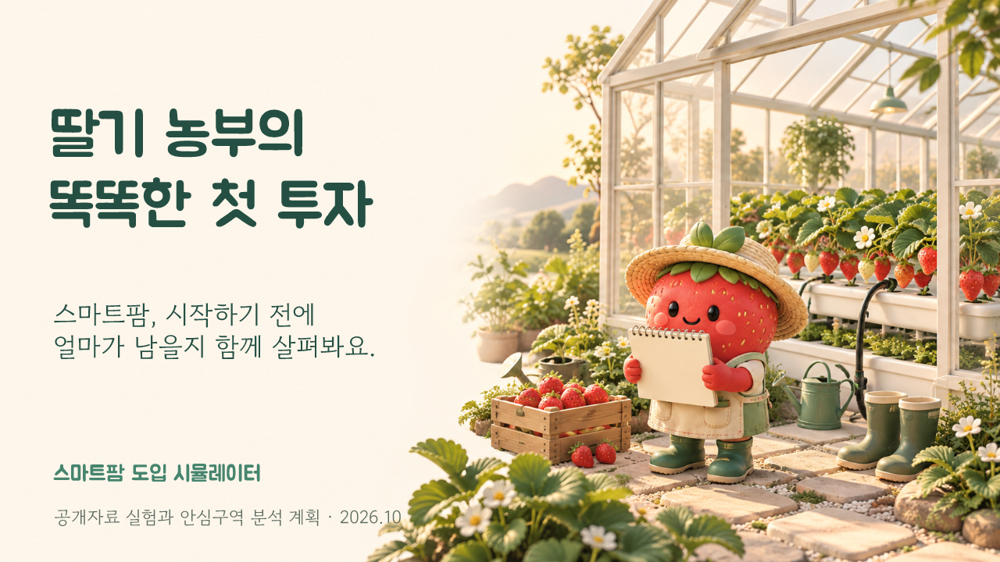
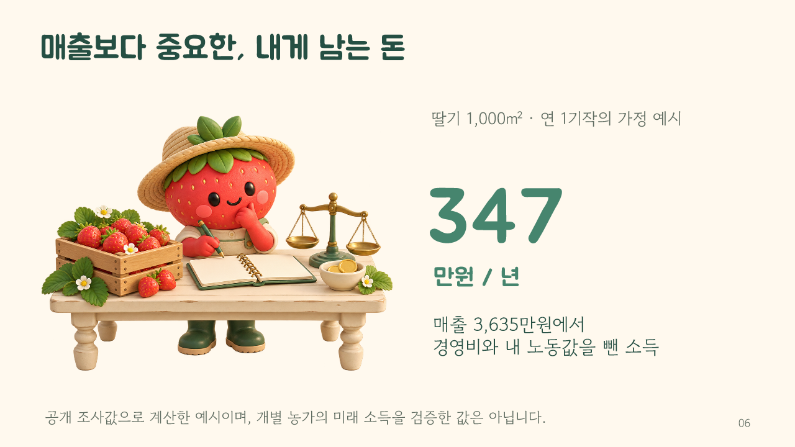

# 딸기 농부의 똑똑한 첫 투자

[발표자료 다운로드](smartfarm_proposal.pptx) · [글꼴 묶음](fonts/smartfarm_cute_fonts.zip)

스마트팜 도입 전 수확량·판매단가·운영비·설비비 가정을 비교하는 기획서입니다. 본편 14장과 근거 부록 14장, 총 28장입니다. 본편은 농가의 계획부터 비용과 소득, 투자금 회수, 모델 실험과 현장 분석 순서로 설명합니다.

제목은 주아체, 본문은 고운돋움체를 사용합니다. 새 딸기 농부 일러스트 10장이 설명을 돕고, 숫자·표·차트는 편집할 수 있습니다. 생성 그림은 실제 농장이나 제품 사진이 아닙니다. [그림과 생성 문안](../assets/illustrated/README.md)

다른 PC에서 편집하려면 [글꼴 설치 안내](fonts/README.md)를 따라 두 폰트를 설치하세요. PPT 내부에는 글꼴이 임베딩되어 있지 않습니다.

공개자료 실험과 경제성 가정, 실제 안심구역 분석 계획을 구분합니다. 약 347만원의 연 소득은 자가노동 기회비용을 반영한 시연 값이고, 6년차 투자금 회수는 그 비용을 차감하기 전 현금흐름 기준입니다. 실제 미개방 원자료의 성능은 현장에서 검증해야 합니다. 상세 데이터·단위·전체 모델 점수·제약은 부록에 있습니다.
